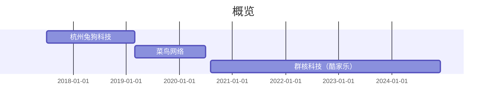

# 关于 (About me)

姓名: `付晨伟(洛特/Lot)`

年龄：`29👴🏻` 

邮箱：`📮：15706804793@163.com`

微信：`kill_word`

当前状态：`在职💡`

求职意向：`前端开发👨🏻‍💻`

Base地：`杭州`

兴趣/爱好：`健身💪🏻` `跑步🏃🏻‍♀️` `游戏🎮` `旅行✈️`

 

# 专业技能（Tag）

`HTML` `CSS`

`React` `Three` `Pixi`  `D3.js` `Rxjs`

`Webpack` `Vite`
 
`Git` `Shell` `Nginx`

`架构设计`

 
 

# 工作经历 (experience)

 

---

 

## 群核科技（酷家乐）
### 2023.8~至今：商业空间工具前端部

职能：前端负责人

子品牌`酷空间`前端负责人，负责商业空间整体公装前端解决方案支持，商空前端部门前端标准化体系建设及人员梯度管理

部分项目：

- CAD智能识别： 
  技术栈：`React` `Math.js（内部几何库）` `EGS（内部渲染引擎，类Three）` 
  角色：`技术负责人`
  简介：服务CAD文件快速转换酷家乐户型方案，桥接快速智能放置的自动工具

  成果：目前在酷家乐的公装版本（酷空间）开放，目前公装版本入口留存比例达到78%，次周留存比例达到74%，给整体公装用户量带来越42%的提升，部分KA用户账号升级消费比例提升30%

 

- 广告3D编辑工具： 
  技术栈：`React、Math.js（内部几何库）` `EGS（内部渲染引擎，类Three）` `gemo-kernal(内部造型引擎)` 
  角色： 技术负责人 
  简介：服务广告客户进行快速的2D转3D场景还原（类figma的vector-to-3d插件形态）、提供一体化的场景渲染、场景对象编辑、渲染效果图生成等解决方案支持 
  成果：完成与 ”我图网“等商业平面素材网站，及”思百特“等品牌文化设计公司的生态合作，目前季度回款额达500W，全年预计回款约1800W
 
 

### 2022.5~2023.8：办公空间业务拓展线
职能：TO技术负责人
负责办公空间公装场景业务解决方案支持
部分项目：

- 办公家具一体化解决方案支持： 
  技术栈：`React` `Math.js（内部几何库）` `EGS（内部渲染引擎，类Three）` 
  角色：前端开发 
  简介：公装装修场景，头部KA存在很多大型办公空间方案搭建还原的效率痛点，以此为背景公司尝试涉足公装领域，以办公家具场景为切面提供从场景搭建到渲染、报价等一体化的解决方案支持，个人作为技术TO参与项目落地，在该项目中着重在以下几个场景给与支持：
  `1.最小成本复用已有家装业务模块的基础建设，以开闭原则进行上层拓展封装，在不对底层侵入前提下完成公装特化接口设计` 
   `2.提供了 P2P/L2L/P2F/P2L/P2A (P: 点、L：线、F：面、A：弧、2：to 连接)等多种造型结构设计，辅助特化场景的精准摆放提速` 
   `3.配合脚本语法设计，完成前端脚本执行流程接入，并提供可视化的脚本编辑器辅助业务同学进行符合业务预期的脚步编写` 
   `4.性能瓶颈突破，全链路的performance排查，并完成初版LOD流程设计，目前已可支持最大2000m²场景渲染及交互支持，整体提升约40%` 
   
  成果：与圣奥、震旦等多个公装领域头部企业达成长期战略合作，覆盖旗下70%网点，单季度营收超400W元
 
 

### 2020.8~2022.5：定制工具前端部
职能：前端开发工程师 
负责日常酷家乐定制业务前端场景工具开发与支持 
部分项目：

- 场景信息记录及控制台模块 
  技术栈：`React` `localforage` `Json-mapper` 
  角色：前端开发 
  简介：类传统工业工具，场景交互操作需要有明确的行为记录，用以辅助用户判断，在异常事故现场也可以辅助技术支持进行问题判断，该工具一共有以下几个关键实现： 
    `1. 基于AOP切面设计无侵入的对模型编辑流程进行了有效的监控。` 
    `2.基于localforage库对用户日志文件进行了妥善的持久化存储并衔接了定时持久化至服务端的流程，降低异常场景的问题定位成本。` 
  `3.提供了flex的scheme允许接入模块进行自定义的用户提示文案自定义` 
  成果：完成定制工具线全场景模型变更流程接入，单日记录条目次数达90W次，为用户日常操作及记录回溯提供有效帮助
 

- 飞天——上传中台前端SDK 
  技术栈：`Vite` `Webpack` 
  角色：前端开发

  简介：基于企业出海背景，对全域全链路原有的离散的前端上传链路进行收口，在sdk内内化OSS、COS等两种云服务模块，降低前端上传对接的心智负担，提供了文件敏感检查、超限检测、异常信息追溯等功能，并为后续海外环境配置一体可控提供了弹性空间
  成果：完成全域前端OSS上传链路接入，全域上传链路异常信息可追溯，云服务迁移成本降低，为海外环境弹性云存储能力提供助力
 
 

## 菜鸟网络

### 2019.3~2020.8: 履行事业部

职能：前端开发工程师
负责履行运力整体链路业务支持，为仓配线路优化、仓储调度提供可视化解决方案支持

部分项目：

- 北斗——网络仿真：提供片区车型、单量及仓储情况进行物流路由智能评估，路由网络优化建议、物流线路模拟、成本预估等功能
  技术栈：`React` `Umi` `rxjs` `Amap` 
  角色：前端TO 
  简介：基于整体物流节点数据结构进行合理分层，类ECS设计模式抽象线路对象、节点对象的视图展示模块及交互功能模块，实现灵活组装的能力，（省/市/区/县）基于扁平索引结构达成快速的线路聚合及炸开设计，使用rxjs进行了实时推流状态process的封装保证了多路由执行场景的数据稳定，使用类静态图模式的思路进行画布性能优化（减少不必要的Componet update,进行纯视图层更新），最大渲染线路数量可达10W条，帧率稳定在30帧 

  成果：为一线实操落地8条真是优化链路，降本提效达900W
 
  ​

- 履行——预分拣片区划分：提升末端站点片区划分精度，提升预派收件响应速度

  角色：前端开发

  技术栈：`Walle（内部框架)` `Amap`  `JSTS` 
  简介：使用JSTS类库对GIS部门的边界数据进行优化，使用高德Amap进行区域展示，配合高德内部同学进行画布精度调优等
  成果：覆盖整体C类、B类物流路由网络，整体合作生态公司派送精度提升20%

 
 

## 杭州兔狗科技有限公司

2017.7~2019.2

职能：前端开发工程师
负责内容增长平台建设、C端日常活动支持、平台业务迭代支持

部分项目：

- 企业SEO优化
  技术栈：`Vue`
  简介：进行了全站主要功能区组件抽象（导航栏、底部栏等），基于服务器预编译解决SEO相关问题
  ​

- 内容增长平台
  技术栈：`WangEditor` `Vue`
  简介：基于Vue.2x搭建的一整个内容平台， 用以辅助营销团队进行促单引流文章产出，提供内容编辑、文章展示及评论社群能力，核心编辑器基于Vue进行视图层搭建，indexDb进行temp编辑状态保持，基于postmessage封装RPC接口进行多iframe间的安全通信
  ​
  成果：完成内容编辑器及内容平台建设，相关KOL产出内容3000+篇，相关商品的当年pv/uv提升80%，促单率达60%
 
 

### 教育经历
#### 丽水学院
专业：`计算机科学与技术`
时间：`2013.9~2017.6`
Tag: `优秀毕业生` `CET6`

>   Online Web Qrcode:

>   wx:

